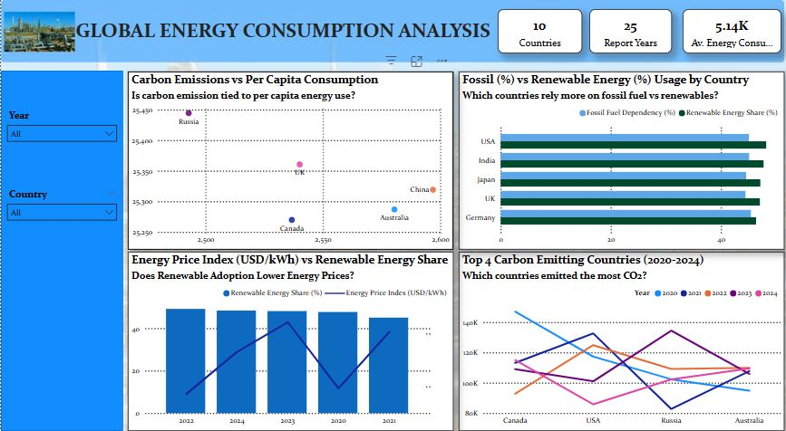

#Global Consumption
##Overview
This dashboard explores patterns in global energy use, comparing fossil fuel reliance, renewable energy share, Carbon monoxide emissions, and energy prices across 10 countries over a period of 25 years.
###Key Metrics
-Countries: 10
Report Years: 25
Average Energy Consumption: 5,140 kWh per capita
##Dashboard Screenshot

